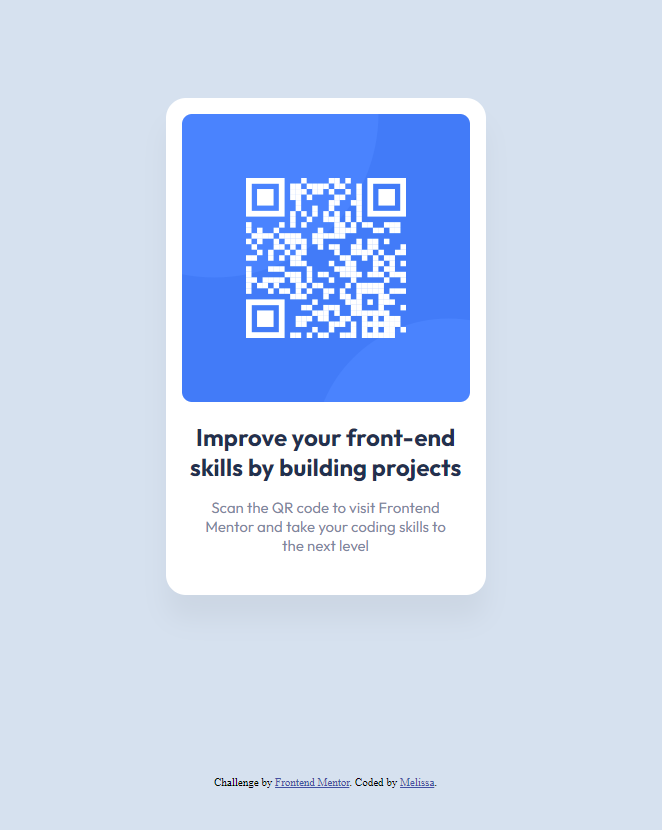

# Frontend Mentor - QR code component solution

This is a solution to the [QR code component challenge on Frontend Mentor](https://www.frontendmentor.io/challenges/qr-code-component-iux_sIO_H).

## Table of contents

- [Overview](#overview)
  - [Screenshot](#screenshot)
  - [Links](#links)
- [My process](#my-process)
  - [Built with](#built-with)
  - [What I learned](#what-i-learned)
  - [Continued development](#continued-development)
  - [Useful resources](#useful-resources)
- [Author](#author)
- [Acknowledgments](#acknowledgments)

## Overview

### Screenshot



### Links

- Solution URL: [https://github.com/MelissaZhuu/qr-code-component-main](https://github.com/MelissaZhuu/qr-code-component-main)
- Live Site URL: [https://melissazhuu.github.io/qr-code-component-main/](https://melissazhuu.github.io/qr-code-component-main/)

## My process

### Built with

- Semantic HTML5 markup
- CSS custom properties
- Flexbox

### What I learned

I learned how to translate a simple design from Figma to HTML and CSS. I improved my understanding of CSS flexbox and how to pair it with positioning. For example, here, I wanted to maintain flexbox's centering of the components, but also having the QR code be 16px from the top of the card:

```css
.card {
    display: flex;
    flex-direction: column;
    justify-content: center;
    align-items: center;
    position: relative;
}

.qr-code {
    position: absolute;
    top: 16px;
}
```

I also learned how to change box shadow opacity with rgba:

```css
.card {
    box-shadow: 0px 25px 25px rgba(0,0,0,0.0477);
}
```

### Continued development

I would like to continue to work on applying my HTML, CSS and JavaScript knowledge in these little projects. I want to have a solid foundation and understanding of CSS positioning as I've struggled in the past getting HTML content to do what I want and I think I need to master these basics before moving on. It would also be cool to incorporate CSS preprocessors like Sass in future projects too and maybe frameworks like Bootstrap just to gain insight on how these tools work. I also hope to incorporate React more in the future to practice building components and using hooks and props in more complex projects.

### Useful resources

- [CSS Basics](https://web.dev/learn/css) - This website goes over all the CSS concepts which I used for a refresher.
- [CSS Flexbox Cheat Sheet](https://yoksel.github.io/flex-cheatsheet/#section-display) - I found this amazing CSS flexbox cheat sheet that was really helpful. You can toggle the different flexbox properties and see how the items behave.

## Author

- Website - [GitHub](https://github.com/MelissaZhuu)
- Frontend Mentor - [@MelissaZhuu](https://www.frontendmentor.io/profile/MelissaZhuu)

## Acknowledgments

I'm happy to have found Frontend Mentor, it's been a very helpful and unique resource for an aspiring web developer and is helping me crawl out of tutorial hell.
