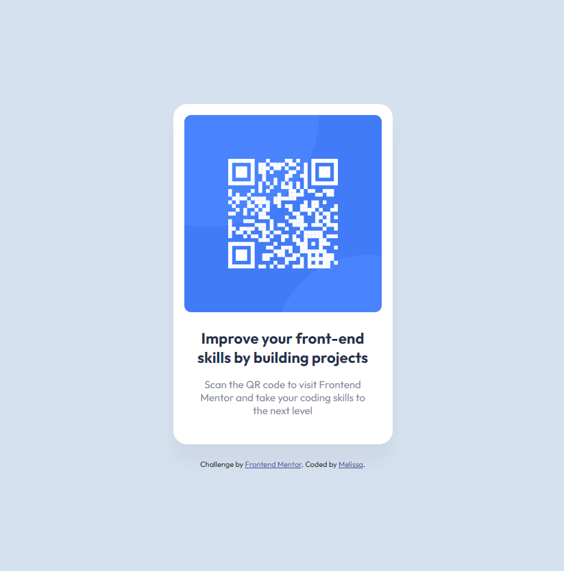

# Frontend Mentor - QR code component solution

This is a solution to the [QR code component challenge on Frontend Mentor](https://www.frontendmentor.io/challenges/qr-code-component-iux_sIO_H).

## Table of contents

- [Overview](#overview)
  - [Screenshot](#screenshot)
  - [Links](#links)
- [My process](#my-process)
  - [Built with](#built-with)
  - [What I learned](#what-i-learned)
  - [Continued development](#continued-development)
  - [Useful resources](#useful-resources)
- [Author](#author)
- [Acknowledgments](#acknowledgments)

## Overview

### Screenshot

### Links

- Solution URL: [https://github.com/MelissaZhuu/qr-code-component-main](https://github.com/MelissaZhuu/qr-code-component-main)
- Live Site URL: [https://melissazhuu.github.io/qr-code-component-main/](https://melissazhuu.github.io/qr-code-component-main/)

## My process

### Built with

- HTML5
- CSS
- Flexbox

### What I learned

In my first attempt at this challenge, I focused on learning how to translate a simple design from Figma to HTML and CSS. I stuck with pixel units and only had the goal of understanding CSS flexbox more. In my original code, I paired flexbox with relative and absolute positioning to format elements how I wanted, and at the time, I thought it was a good solution. 

However, after a couple days, I spent some time cleaning up my code and looking for ways to improve it. I knew that my final component didn't look or behave exactly as the design intended or as I wanted it to. For example, I realized that using absolute positioning and fixed pixel units made my component unresponsive, and adjusting the size of the browser made the text overlap the QR code. Therefore, I changed all the units to be responsive, and I found a way to format everything with only flexbox.

I also fixed the attribution at the bottom, changing the font to match the card component, and fixed up the links so they would open the appropriate pages in a new tab.

Something interesting I came across while researching how to use em and rem units properly, was the "62.5 percent" technique. Normally, the base font-size is 16px, but this project uses 15px for the body text and 22px for the heading. This means that if I convert the em values based on the default 16px, I would get 1.375em (22px) and 0.9375em (15px). This long string of decimals didn't seem ideal at all. The 62.5 percent technique involves setting the base font-size to 10px(62.5% of 16px) instead, making the new em values 2.2em (22px) and 1.5em (15px), which looks much better!

### Continued development

I would like to continue to work on applying my HTML, CSS and JavaScript knowledge in these little projects. I want to have a solid foundation and understanding of CSS positioning as I've struggled in the past getting HTML content to do what I want and I think I need to master these basics before moving on. It would also be cool to incorporate CSS preprocessors like Sass in future projects too and maybe frameworks like Bootstrap just to gain insight on how these tools work. I also hope to incorporate React more in the future to practice building components and using hooks and props in more complex projects.

### Useful resources

- [CSS Basics](https://web.dev/learn/css) - This website goes over all the CSS concepts which I used for a refresher.
- [CSS Flexbox Cheat Sheet](https://yoksel.github.io/flex-cheatsheet/#section-display) - I found this amazing CSS flexbox cheat sheet that was really helpful. You can toggle the different flexbox properties and see how the items behave.
- [Using em vs. rem in CSS](https://blog.logrocket.com/using-em-vs-rem-css/) - This article goes over when to use em and rem and talks about the "62.5 percent" technique.

## Author

- Website - [GitHub](https://github.com/MelissaZhuu)
- Frontend Mentor - [@MelissaZhuu](https://www.frontendmentor.io/profile/MelissaZhuu)

## Acknowledgments

I'm happy to have found Frontend Mentor, it's been a very helpful and unique resource for an aspiring web developer and is helping me crawl out of tutorial hell.
